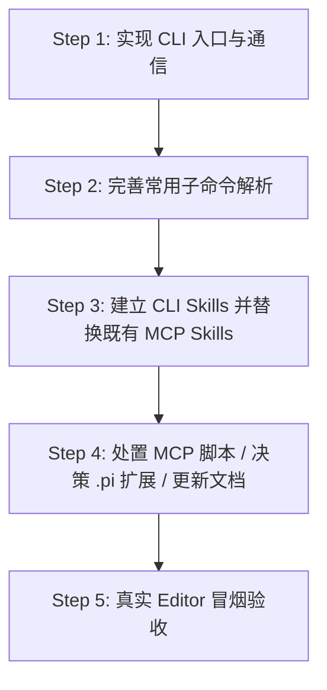

# Handoff: pi-unity-harness 转向纯 CLI 架构（CLI-Only）迁移指南

> **文档性质**：Agent 间交接文档（Handoff Document）
> **目标**：将 `pi-unity-harness` 从基于 MCP（Model Context Protocol）桥接的架构，参考 `unity-cli-loop`（`uloop`）的设计，全面转为纯命令行架构（CLI Only, No MCP）。

---

## 一、 项目背景与现状

### 1. 相关仓库与路径
- **当前项目（改造主体）**：`F:\Projects-Test\unity-ai-tool\pi-unity-harness`
  - 原定位：AI 编码代理与 Unity Editor 之间的桥接层。
  - 当前底层：Rust cdylib Native Broker（持久化 Named Pipe Server）+ Unity C# Managed Worker + `Library/PiUnityHarness/bridge.json`。
  - 当前外部接口：`.pi/extensions/`（pi 扩展）与 `scripts/mcp-server.mjs`（基于 `@modelcontextprotocol/sdk` 的 MCP 服务）。
- **参考项目（标杆设计）**：`F:\Projects-Test\unity-ai-tool\unity-cli-loop`
  - 定位：纯 CLI 架构（`uloop` 工具）+ Agent Skills（`SKILL.md`）。
  - 核心哲学：**CLI-First / No-MCP**。Agent 通过执行 shell 命令与 Unity 交互，依托 Skill 文件让 Agent 感知命令规范与工作流。

### 2. 为什么从 MCP 转向纯 CLI？
1. **Agent 100% 通用**：MCP 需要特定的 Agent 客户端宿主支持（Claude Desktop, Cursor 等）且配置繁琐；CLI 只要 Agent 能执行 shell 命令（Claude Code, Codex, Antigravity, Pi, Aider, CI/CD 等）即可直接工作。
2. **进程与连接生命周期解耦**：MCP 长连接如果异常断开或进程崩溃，会导致 Agent 会话失能；CLI 是独立子进程短调用，天然防挂死、无状态。
3. **上下文可控与防爆**：命令行工具可以将大图、多帧序列、长日志自动落地到磁盘（如 `Temp/PiUnityHarness/Captures/`），只向 stdout 返回文件路径与关键摘要，彻底解决 MCP 经常遭遇的 `413 Payload Too Large` 和 Agent 上下文被垃圾数据淹没的问题。
4. **单步调试极其简单**：开发者或测试可以直接在 PowerShell/Terminal 输入 `pi-unity eval "..."` 进行即时验证。

---

## 二、 架构设计对齐

```text
┌────────────────────────────────────────────────────────┐
│   AI Agent (任何模型/工具，CLI+Skill 直达)             │
│   pi-coding-agent → .pi 扩展（typed tools 薄封装）     │
└───────────────────────────┬────────────────────────────┘
                            │ Shell Command (例如: pi-unity eval "...")
                            ▼
┌────────────────────────────────────────────────────────┐
│            pi-unity CLI (命令行二进制 / 脚本)           │
│  - 读 <UnityProject>/Library/PiUnityHarness/bridge.json │
│  - 连接 Windows Named Pipe（名见 bridge.json）        │
│  - 发送单行 JSONL 请求，接收响应，格式化 stdout/stderr  │
└───────────────────────────┬────────────────────────────┘
                            │ Named Pipe (JSONL 协议)
                            ▼
┌────────────────────────────────────────────────────────┐
│             Unity Editor 进程 (已实现，保持复用)        │
│  ├── Rust Native Broker (cdylib, 跨域重载存活)         │
│  └── C# Managed Worker (EditorApplication.update 派发) │
└────────────────────────────────────────────────────────┘
```

> **注意**：Unity Editor 内部现有的 Rust cdylib broker、C# worker、Pipeline 命令、Vision/UiTree/Eval 原语已经非常成熟且完整，**本次改造的核心是「外部客户端接入层」：用 CLI 取代 MCP Server**。

---

## 三、 CLI 命令规格设计（Command Specifications）

CLI 命令应遵循标准 Unix/POSIX CLI 规范，输出支持人类可读与结构化 JSON（通过 `--json` 控制）。

### 1. 命令映射表

| CLI 子命令 | 内层协议请求（原 MCP 工具） | 参数选项 | 行为描述 |
| :--- | :--- | :--- | :--- |
| `pi-unity ping` | `ping`（`unity_ping`） | `--timeout <ms>` | 探测 Unity Broker 连通性 |
| `pi-unity status` | `status`（`unity_status`） | `--json` | 获取 Editor 状态、域重载代次、焦点与弹窗状态 |
| `pi-unity eval <code>` | `validate_execute_code`（`unity_eval` / `unity_eval_file`） | `-f, --file <path>` | 在 Unity 主线程执行 C# 代码或执行脚本文件 |
| `pi-unity compile` | `recompile`（`unity_recompile`） | `--timeout <ms>` | 触发 Unity 脚本重新编译；**预期连接断开，需重连后轮询至 ready**（见 Gotcha #2） |
| `pi-unity snapshot` | `context_snapshot`（`unity_snapshot`） | `--depth <N>`<br>`--max-nodes <N>`<br>`--log-limit <N>`<br>`--log-level <error\|warning\|all>`<br>`--no-components` | 获取活动场景层级、组件选择和近期日志 |
| `pi-unity list-commands` | `list_commands`（`unity_list_commands`） | `--json` | 列举已注册的 Pipeline `[CliCommand]`（供扩展与 Agent 发现命令及参数 schema） |
| `pi-unity pipeline <name>` | `command`（`unity_pipeline`） | `-p, --param <key=val>`<br>`--params-json <json>` | 执行 Unity Pipeline `[CliCommand]` |
| `pi-unity run-tests` | `command` → `run_tests` | `--mode <edit\|play>`<br>`--filter <pattern>` | 运行 Unity 测试套件的快捷命令 |
| `pi-unity observe` | `command` → `vision_observe` | `--frames <N>`<br>`--interval <ms>`<br>`--overlay <grid\|annotations\|both\|none>` | 视觉跑测感知（多帧捕获 + dHash + 变化检测） |
| `pi-unity capture` | `command` → `vision_capture` | `--mode <game\|scene>`<br>`--out <path>` | 单张视口截图（速度模式） |
| `pi-unity timeline` | `timeline`（`unity_timeline`） | `--limit <N>`<br>`--success <all\|success\|failure>` | 查询操作审计历史 |

> 注：初版不提供交互式 REPL。REPL 需要额外的连接保活、提示符与中断语义设计，如确有需要应作为独立增强单独立项。

### 2. 标准输出与退出码约定
- **Exit Code `0`**：执行成功。
- **Exit Code `1`**：执行失败 / 运行时错误（错误信息输出到 stderr；`--json` 模式下 stdout 输出带 `ok: false` 的 JSON）。
- **Exit Code `2`**：未能建立连接 —— Unity 未启动 / Bridge 未就绪（找不到 `bridge.json` 或 Pipe 连接失败）。
- **Exit Code `3`**：连接已建立，但操作超时或主线程卡死无响应。
- **超大内容处理**：当输出为大图（Base64）或超长日志时，自动保存至 `<UnityProject>/Temp/PiUnityHarness/Captures/`（与 `scripts/mcp-server.mjs` 中 `stripLargeBase64` 的现行行为一致），终端输出仅打印相对路径和尺寸摘要；禁止向 stdout 倾倒 Base64。

---

## 四、 技术实现选型建议

接手的 Agent 可从以下两种路径中选择其一落地（优先推荐方案 A）：

### 方案 A：Rust 原生 CLI 二进制（🔥 最佳方案，无 Node.js 运行时依赖）
- **实现位置**：`native/src/bin/pi_unity.rs`（或在 `Cargo.toml` 中配置 `[[bin]]`）。
- **优势**：
  - 仓库内已有现成的 Rust 工程环境（`native/Cargo.toml`）。
  - Rust 编译出独立的 `pi-unity.exe` 单文件二进制（体积小、启动毫秒级、无需 Node.js 环境）。
  - 直接读 `Library/PiUnityHarness/bridge.json`，通过 Windows Named Pipe 发送/接收 JSONL。
- **既有工程约束（动手前必读）**：
  - `native/Cargo.toml` 当前为 `crate-type = ["cdylib"]`：若 bin 需复用 lib 中的协议代码，须改为 `["cdylib", "rlib"]`；否则 bin 只能完全独立实现。
  - 现有依赖仅 `tokio` / `serde` / `serde_json`（且限定 `cfg(windows)`）：进程扫描（Toolhelp/WMI，需 `windows` crate）、CLI 参数解析（`clap` 或手写）、Base64 处理均需**新增 crate 依赖**。本方案的真实卖点是"无 Node.js 运行时"，不是"零依赖"。
  - Named Pipe 为 Windows 专用实现，CLI 仅需支持 Windows（与 Editor 宿主一致）；对外宣称适用环境时以此为准。
- **分发**：编译至 `dist/` 或直接安装在系统 PATH 中。

### 方案 B：Node.js / TypeScript CLI（🚀 最快落地）
- **实现位置**：`bin/pi-unity.mjs` 或 `src/cli/index.ts`。
- **优势**：
  - `scripts/mcp-server.mjs` 中的 `UnityHarnessClient`（约第 200 行起）是本仓库最完整的 pipe 协议客户端参考实现：进程扫描、`bridge.json` 解析、Named Pipe 连接、超时控制、Base64 自动剥离落地（`stripLargeBase64` → `Temp/PiUnityHarness/Captures/`）。
  - 仅需引入轻量 CLI 解析库（或用 Node 原生 `util.parseArgs`），剥离 `@modelcontextprotocol/sdk` 即可完成。
- **风险（动手前必读）**：
  - ⚠️ `@modelcontextprotocol/sdk` 从未在本仓库任何 `package.json` 中声明，`node_modules` 中也未安装——`mcp-server.mjs` 当前**无法直接运行**，其逻辑近期未经真实使用验证，复用前须逐段核对。
  - ⚠️ 该客户端**没有域重载后的自动重连逻辑**（仅 `socket.destroy()` + ping 保活）；`compile` 所需的重连轮询必须新写（见 Gotcha #2）。

---

## 五、 接手 Agent 实施路线图（Action Plan）



### Step 1：构建 CLI 工具核心（Core CLI Implementation）
1. 实现项目路径自动发现（优先命令行 `--project-path`，其次当前工作区，再次向上逐级查找 `Library/PiUnityHarness/bridge.json`，最后回退至扫描 `Unity.exe` 进程命令行）。
2. 实现 Named Pipe 通信客户端，并支持 `--json` 输出与格式化美化输出。
3. 增加退出码与异常处理（如 Unity 未运行、模态弹窗阻塞、域重载中）。

### Step 2：实现全部子命令
- 优先支持核心高频命令：`status`, `eval`, `compile`, `snapshot`, `pipeline`。
- 支持快捷指令：`run-tests`, `capture`, `observe`。

### Step 3：建立 CLI-First Agent Skills（参考 `uloop`）
1. 对齐 `uloop` 的实际做法——**每个高频命令一个细粒度 Skill + 安装同步机制**：uloop 在 `.agents/skills/` 维护约 20 个 `uloop-*` skill，源文件集中在包内，由 `uloop skills install` 生成副本同步到 `.agents/` / `.claude/`（生成副本禁止直接编辑，见 `unity-cli-loop/AGENTS.md` "Generated Skill Files" 一节）。本仓库对应落地：
   - Skill 源文件放 `skills/`（现为单份 `pi-unity`，细节在 `references/`），并提供安装/同步脚本或明确的拷贝步骤；
   - **改造或替换**既有的 `skills/unity-harness-mcp` 与 `skills/unity-playtest-loop`（二者均以 MCP 为前提），并清理已安装的生成副本（如 `.agents/skills/unity-harness-mcp`）。
2. Skill 内容须传达：
   - 基础命令格式与参数。
   - **双模式机制（Speed 模式 vs GUI 验证模式）**：
     - **速度模式（默认）**：`pi-unity snapshot` + `pi-unity eval` + `pi-unity pipeline uitree_*`（纯文本/结构化树，耗时短，不看图）。
     - **GUI 模式（按需）**：`pi-unity observe` + 视觉分析。

### Step 4：清理与文档收尾
1. **MCP 脚本处置**：将 `scripts/mcp-server.mjs` 与 `scripts/mcp-handshake.mjs` 标记为 legacy 归档（或删除）。注意：`@modelcontextprotocol/sdk` 从未在本仓库任何 `package.json` 中声明、也未曾安装，这两个脚本当前已无法运行——不存在"移除依赖"的动作，只有"处置脚本"的动作。
2. **`.pi` 扩展处置（已定：A 为终态）**：`.pi/extensions/pi-unity-harness/` **长期保留，但改造为 shell-out 调用 `pi-unity` CLI 的薄封装**——pi-coding-agent 继续使用 typed tools（工具面不变），其他 Agent 统一走 CLI + Skill。为保证 **CLI 与 pi tool 行为一致、消除逻辑分叉**，改造红线如下：
   - 扩展**不得保留任何私有 pipe 客户端 / 协议代码**：bridge 发现、连接、鉴权、断连重连、超时与退出码语义全部由 CLI 单一实现；扩展只做 typed schema ↔ CLI 参数转换，并以 `--json` 解析 CLI stdout 构造结构化返回。
   - **公共逻辑一律下沉到 CLI，禁止复制**：当前扩展 `helpers.ts` 中的 `stripLargeBase64`、`normalizePipelineCommandParams`、`pipelineCommandTimeoutMs`、`PIPELINE_SHORTCUT_COMMANDS` / `PIPELINE_TOOL_EXCLUDE` 等已在扩展与 `mcp-server.mjs` 间存在重复实现，薄封装化时全部删除本地副本，行为以 CLI 输出为准。
   - 扩展工具与 CLI 子命令**一一对应**：CLI 新增子命令时扩展同步加薄封装工具；禁止扩展发明 CLI 不具备的行为。
3. **废弃窗口**：先标记 legacy 并保留一个版本周期（README 显著位置公告 + 迁移说明），再物理删除；git 历史即回滚手段。
4. 更新根目录 `README.md`、`README.en.md`、`docs/protocol.md`、`docs/protocol.en.md`，将 MCP 接入方式改为 CLI 接入方式。

### Step 5：验收与冒烟测试（Acceptance）
参照本仓库 `TASK-REAL-TESTS.md` 的实机测试惯例，对**真实运行的 Unity Editor** 执行以下冒烟矩阵，全部通过方可宣布迁移完成：

| 验证项 | 通过标准 |
| :--- | :--- |
| 全部 11 个子命令 | 对真实 Editor 各执行至少一次，输出符合 §三.2 约定 |
| `compile` 断连重连 | 触发域重载后能自动重连并轮询至 `managedState == "ready"`，exit 0 |
| 退出码路径 | 分别构造成功(0) / 执行失败(1) / Editor 未启动(2) / 超时(3) 四类场景逐一验证 |
| 大图落地 | `capture` / `observe` 的 stdout 仅含文件路径与摘要，无 Base64 |
| `--json` 模式 | 所有子命令的 JSON 输出可被 `ConvertFrom-Json` / `jq` 正常解析 |
| 多项目并存 | 两个 Unity 项目同时打开时，CLI 能正确定位各自的 bridge（pipe 名与 token 隔离） |
| 扩展-CLI 行为一致 | 抽查扩展 typed tools（`eval` / `status` / `pipeline` / `run_tests`）与对应 CLI 子命令对同一 Editor 的输出结构与退出语义一致，且扩展目录中无残留 pipe 客户端 / 协议代码 |

---

## 六、 关键技术细节与约束备忘（Gotchas）

1. **Named Pipe 路径**：
   - **以 `bridge.json` 的 `pipe` 字段为唯一真相，禁止按公式推导**。当前实现为 `\\.\pipe\pi_unity_<项目路径 SHA256 前 6 字节 hex>`（见 `PiUnityBridge.cs` 的 `GetOrCreatePipeName` / `ShortHash`，经 `SessionState` 跨域重载保持稳定）。注：本文档与 `docs/protocol*.md` 此前误写为 `pi_unity_harness_<fnv1a_hash>`——FNV-1a 实际只用于 `statePlaneName` 的派生，相关文档已更正。
   - 必须在请求帧中携带 `bridge.json` 中的 `token`，否则会被 Rust Broker 拒绝（`unauthorized`）。
2. **Domain Reload（域重载）期间的处理**：
   - Broker 的 Pipe **监听**在域重载期间保持，但**每条已建立的连接会断开重建**（见 `docs/protocol.md`「连接生命周期」相关说明）；重载期间到达的转发类请求会被拒绝为 `managed_reloading`。
   - 因此 `compile` 的完整流程必须是：发送 `recompile` → **预期当前连接断开 / 超时** → **重新连接 Pipe**（必要时重读 `bridge.json`）→ 轮询 `status` 直至 `managedState == "ready"`。切勿在已断开的旧连接上轮询。
3. **Modal 弹窗阻塞检测**：
   - 若 Unity 弹出模态窗口（如 Save Scene / Dialog），主线程可能会挂起。CLI 可通过 Broker 的 `status` 查看 `modalObservation.present`，并提示用户或自动处理。
4. **大文件与图片落地**：
   - 所有的截屏输出文件统一写入 `<UnityProject>/Temp/PiUnityHarness/Captures/`（与现行 `stripLargeBase64` 行为一致），禁止直接向终端倾倒庞大的 Base64 字符串。
5. **协议版本握手**：
   - 连接后应先调用 `bridge_capabilities` 核对 `protocolVersion` 与 `capabilities[]`（Rust 侧常量 `NATIVE_PROTOCOL_VERSION`），不兼容时给出明确报错而非静默失败——CLI 是长期分发的独立二进制，必须能感知协议演进。
